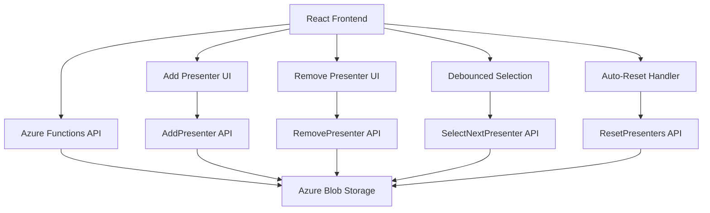

# Design Document

## Overview

This design enhances the existing presenter selection application with comprehensive presenter management capabilities, debounced interactions, and automatic reset functionality. The solution maintains the current Azure Functions backend architecture while extending both frontend and backend components to support CRUD operations, improved user experience, and robust state management.

The current system uses React for the frontend with Azure Functions and Blob Storage for the backend. The enhancement preserves this architecture while adding new API endpoints and frontend components for presenter management.

## Architecture

### Current Architecture
- **Frontend**: React application with hooks-based state management
- **Backend**: Azure Functions with HTTP triggers
- **Storage**: Azure Blob Storage for presenter data persistence
- **Data Format**: JSON array of presenter objects with status tracking

### Enhanced Architecture
The enhanced system maintains the same architectural patterns while adding:

- **New API Endpoints**: AddPresenter, RemovePresenter, ResetPresenters
- **Enhanced Frontend State**: Debouncing logic, loading states, error handling
- **Improved Data Validation**: Both client-side and server-side validation
- **User Feedback System**: Toast notifications and loading indicators
- **Modern React 18**: Upgraded to React 18 with concurrent features and modern APIs
- **TypeScript Integration**: Full TypeScript implementation for type safety and better developer experience



## Components and Interfaces

### Frontend Components

#### Enhanced App Component (TypeScript)
- **State Management**: Extended to include loading states, error messages, and debouncing
- **TypeScript Integration**: Fully typed with interfaces for all props and state
- **React 18 Features**: Uses modern hooks and concurrent features where appropriate
- **New State Variables**:
  - `isLoading`: boolean for tracking API operations
  - `error`: string | null for error messages
  - `isSelecting`: boolean for debouncing presenter selection
  - `showAddForm`: boolean for add presenter form visibility
  - `newPresenterName`: string for form input

#### AddPresenterForm Component
- **Purpose**: Modal or inline form for adding new presenters
- **Props**: onAdd, onCancel, isLoading
- **State**: Form validation and input handling
- **Validation**: Name required, no duplicates, character limits

#### PresenterItem Component
- **Purpose**: Individual presenter display with remove functionality
- **Props**: presenter, onRemove, isLoading
- **Features**: Status-based styling, remove button with confirmation

#### NotificationSystem Component
- **Purpose**: Toast notifications for user feedback
- **Types**: Success, error, info notifications
- **Auto-dismiss**: Configurable timeout for different message types

### Backend API Endpoints

#### AddPresenter Function
```javascript
// POST /api/AddPresenter
{
  "name": "string" // Required, non-empty
}
// Response: { presenters: [...], success: boolean, message: string }
```

#### RemovePresenter Function
```javascript
// DELETE /api/RemovePresenter
{
  "name": "string" // Required, must exist
}
// Response: { presenters: [...], success: boolean, message: string }
```

#### Enhanced SelectNextPresenter Function
- **Debouncing**: Server-side request deduplication
- **Auto-Reset**: Automatic status reset when all presenters are selected
- **Improved Error Handling**: Better error messages and recovery

#### ResetPresenters Function
```javascript
// POST /api/ResetPresenters
// No body required
// Response: { presenters: [...], success: boolean, message: string }
```

## Data Models

### TypeScript Interfaces

#### Presenter Interface
```typescript
interface Presenter {
  name: string;                    // Unique identifier and display name
  presentationStatus: PresentationStatus; // Enum for status values
  id?: string;                     // Optional: UUID for better identification
  addedDate?: string;              // Optional: ISO date string for audit trail
}

enum PresentationStatus {
  NOT_SELECTED = 0,
  ASSIGNED = 10,
  PRESENTED = 20
}
```

#### API Response Interface
```typescript
interface ApiResponse<T = any> {
  presenters: Presenter[];         // Updated presenter list
  success: boolean;                // Operation success indicator
  message: string;                 // User-friendly message
  error?: string;                  // Optional: Error details for debugging
  data?: T;                        // Optional: Additional response data
}
```

#### Frontend State Interface
```typescript
interface AppState {
  presenters: Presenter[];         // Array of presenter objects
  isLoading: boolean;              // Global loading state
  isSelecting: boolean;            // Debouncing state for selection
  error: string | null;            // Current error message
  showAddForm: boolean;            // Add form visibility
  newPresenterName: string;        // Form input value
  notification: Notification | null; // Current notification object
}

interface Notification {
  id: string;
  type: 'success' | 'error' | 'info';
  message: string;
  timeout?: number;
}
```

## Error Handling

### Frontend Error Handling
- **Network Errors**: Retry mechanism with exponential backoff
- **Validation Errors**: Real-time form validation with clear error messages
- **State Recovery**: Graceful degradation when API calls fail
- **User Feedback**: Toast notifications for all error conditions

### Backend Error Handling
- **Blob Storage Errors**: Retry logic and fallback mechanisms
- **Validation Errors**: Comprehensive input validation with detailed error messages
- **Concurrency Issues**: Optimistic locking or conflict resolution
- **Data Corruption**: Schema validation and data integrity checks

### Error Scenarios
1. **Duplicate Presenter Names**: Client and server-side validation
2. **Empty Presenter List**: Prevent removal of last presenter
3. **Network Connectivity**: Offline detection and retry mechanisms
4. **Storage Failures**: Graceful degradation and user notification
5. **Concurrent Modifications**: Conflict resolution strategies

## Testing Strategy

### Frontend Testing
- **Unit Tests**: Individual component testing with Jest and React Testing Library
- **TypeScript Tests**: Type checking and interface validation
- **Integration Tests**: API integration testing with mock services
- **User Interaction Tests**: Debouncing behavior and form validation
- **Accessibility Tests**: Screen reader compatibility and keyboard navigation
- **React 18 Tests**: Testing concurrent features and modern hook usage

### Backend Testing
- **Unit Tests**: Individual function testing with Jest
- **Integration Tests**: Blob storage integration testing
- **Load Tests**: Concurrent request handling and debouncing
- **Error Scenario Tests**: Network failures and data corruption scenarios

### End-to-End Testing
- **User Workflows**: Complete presenter management workflows
- **Auto-Reset Testing**: Multi-round selection scenarios
- **Performance Testing**: Large presenter list handling
- **Cross-Browser Testing**: Compatibility across different browsers

### Test Data Management
- **Mock Data**: Consistent test datasets for development and testing
- **Test Isolation**: Independent test environments
- **Data Cleanup**: Automated cleanup of test data

## Implementation Considerations

### Performance Optimizations
- **Debouncing**: 2-second debounce period for presenter selection
- **Optimistic Updates**: Immediate UI updates with rollback on failure
- **Lazy Loading**: Efficient rendering for large presenter lists
- **Caching**: Client-side caching of presenter data

### Security Considerations
- **Input Validation**: Comprehensive validation on both client and server
- **XSS Prevention**: Proper input sanitization and output encoding
- **CORS Configuration**: Appropriate cross-origin resource sharing settings
- **Rate Limiting**: Protection against abuse and excessive requests

### Accessibility Features
- **Keyboard Navigation**: Full keyboard accessibility for all interactions
- **Screen Reader Support**: Proper ARIA labels and semantic HTML
- **High Contrast**: Support for high contrast mode
- **Focus Management**: Proper focus handling for modal dialogs

### Browser Compatibility
- **Modern Browsers**: Support for Chrome, Firefox, Safari, Edge
- **Polyfills**: Necessary polyfills for older browser support
- **Progressive Enhancement**: Graceful degradation for limited functionality